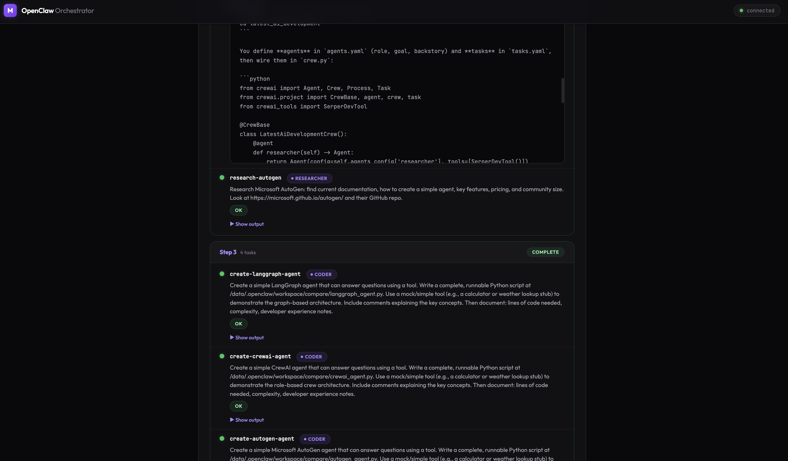

# openclaw-orchestrator

Adaptive multi-agent orchestration for [OpenClaw](https://openclaw.app) gateways.

Break down complex goals into tasks, route them to specialized agents, and iterate until done — all driven by an LLM planner with a real-time web dashboard.

```
                         +-----------+
                         |   Goal    |
                         +-----+-----+
                               |
                         +-----v-----+
                    +--->|   Think   |---+
                    |    +-----+-----+   |
                    |          |         |  "finish"
                    |    +-----v-----+   +---------> Result
                    |    |  Execute  |
                    |    +-----+-----+
                    |          |
                    +----------+
                     results fed back
```

## Why Multi-Agent Orchestration?

Most AI frameworks give a single agent access to everything — all tools, all data, all permissions. That's convenient but fundamentally insecure and inefficient.

**Isolated capabilities by design.** Each agent on the gateway runs in its own sandbox with only the tools it needs. A researcher agent has web search but can't execute code. A coder agent has a bash shell but can't access your database. An analyst has neither — it just reasons over data passed to it. No single agent has the keys to the kingdom.

**Better security posture.** When a coding task goes to an agent that can only write code (not browse the web or call APIs), the blast radius of a prompt injection or hallucination is contained. This is the principle of least privilege applied to AI agents.

**Specialization beats generalization.** Agents configured with focused system prompts (SOUL.md) and specific tool access (TOOLS.md) outperform a single general-purpose agent on domain tasks. A researcher with Brave Search and instructions to cite sources produces better research than a do-everything agent asked to "also search the web."

**The orchestrator coordinates, agents execute.** The LLM planner sees each agent's description and capabilities, then routes tasks to the right specialist. It doesn't need tool access itself — it just decides *what* to do and *who* should do it. Agents don't need to know about each other — they just receive a task and return a result.

```
Orchestrator (LLM planner, no tools)
  ├── researcher  [web-search, browser]        — finds information
  ├── coder       [bash, file-ops]             — writes and tests code
  ├── analyst     [no tools, reasoning only]   — compares and recommends
  └── main        [general]                    — fallback for everything else
```

## Features

- **Adaptive loop** — LLM decides what to do next based on accumulated results, not a rigid pre-planned DAG
- **Multi-agent routing** — tasks are assigned to the best agent by name or capability (researcher, coder, analyst, or any custom agent)
- **Dynamic agent discovery** — agent metadata (description, capabilities, role prompt) loaded from each agent's SOUL.md on the gateway
- **Real-time dashboard** — browser-based UI with SSE streaming, step visualization, and run history
- **3 adapter types** — OpenClaw gateway agents, HTTP endpoints, or plain async functions
- **Robust LLM parsing** — handles markdown-wrapped JSON, prose prefixes, and truncated gateway responses
- **Zero frontend dependencies** — dashboard is a single HTML file with inline CSS/JS

## Quick Start

```bash
# Install
npm install openclaw-orchestrator

# Start the dashboard (connects to your OpenClaw gateway)
openclaw-orchestrator serve -g ws://your-gateway:port/ -t YOUR_TOKEN

# Or run a goal directly from the CLI
openclaw-orchestrator run "Compare React and Svelte for dashboards" \
  -g ws://your-gateway:port/ -t YOUR_TOKEN
```

Open `http://localhost:3000` to see the dashboard.



## Prerequisites

- **Node.js 22+**
- An [OpenClaw](https://openclaw.app) gateway with at least one agent configured

## CLI Reference

### `serve` — Start the web dashboard

```bash
openclaw-orchestrator serve \
  -g ws://host:port/     # Gateway URL (required, repeatable)
  -n my-gateway          # Gateway name (optional, paired with -g)
  -t TOKEN               # Auth token (paired with -g)
  -p 3000                # Dashboard port (default: 3000)
  --host 127.0.0.1       # Dashboard host (default: 127.0.0.1)
```

### `run` — Execute a goal

```bash
openclaw-orchestrator run "Your goal here" \
  -g ws://host:port/ -t TOKEN \
  -c 8                   # Max parallel tasks (default: 8)
  -s 10                  # Max orchestrator steps (default: 10)
```

If a dashboard is running, `run` delegates to it automatically. Use `--no-dashboard` to connect directly to the gateway.

### `plan` — Dry-run the first step

```bash
openclaw-orchestrator plan "Your goal here" -g ws://host:port/ -t TOKEN
```

### `agents` — List discovered agents

```bash
openclaw-orchestrator agents -g ws://host:port/ -t TOKEN
```

### `gateways health` — Check gateway connectivity

```bash
openclaw-orchestrator gateways health -g ws://host:port/ -t TOKEN
```

All commands accept `--debug` for verbose logging.

## Programmatic API

```typescript
import { Orchestrator, FunctionAdapter } from "openclaw-orchestrator";

const orch = new Orchestrator();

// Register agents — can be functions, HTTP endpoints, or OpenClaw gateways
orch.addAgent(new FunctionAdapter({
  name: "researcher",
  description: "Finds information on the web",
  capabilities: ["research", "web-search"],
  fn: async (task) => {
    // Your research logic here
    return `Results for: ${task}`;
  },
}));

orch.addAgent(new FunctionAdapter({
  name: "coder",
  description: "Writes code",
  capabilities: ["coding", "programming"],
  fn: async (task) => {
    // Your coding logic here
    return `// Code for: ${task}`;
  },
}));

// Run with callbacks for real-time updates
const result = await orch.run("Build a URL shortener", {
  maxConcurrency: 4,
  maxSteps: 5,
}, {
  onStepStart: (step, taskIds) => console.log(`Step ${step}: ${taskIds.join(", ")}`),
  onTaskEnd: (step, taskId, result) => console.log(`  ${taskId}: ${result.status}`),
  onFinish: (answer) => console.log("\nDone:", answer),
});
```

## How It Works

1. **Think** — The orchestrator sends the goal and all accumulated results to an LLM, which responds with either:
   - `{ "action": "execute", "tasks": [...] }` — a batch of tasks to run in parallel
   - `{ "action": "finish", "answer": "..." }` — the final synthesized answer

2. **Execute** — Tasks are dispatched to agents based on the `"agent"` field. The orchestrator matches by agent name first, then by capability. Tasks in the same step run concurrently.

3. **Repeat** — Results feed back into the next think step. The LLM sees what succeeded, what failed, and decides what to do next. This continues until the LLM finishes or the step limit is reached.

```
Goal: "Compare React vs Svelte for dashboards"

Step 1 (think):
  → researcher: "Find 2025 benchmarks for React vs Svelte"

Step 2 (think, after research results):
  → coder: "Write a React dashboard component"
  → coder: "Write a Svelte dashboard component"
  → analyst: "Compare frameworks based on research data"

Step 3 (think, after code + analysis):
  → finish: "Here's the comprehensive comparison..."
```

## Agent Adapters

### OpenClaw (gateway agents)

```typescript
import { Orchestrator, GatewayClient, OpenClawAdapter } from "openclaw-orchestrator";

const orch = new Orchestrator();
orch.addGateway({ name: "main", url: "ws://host:port/", token: "..." });

// The CLI does this automatically — agents are discovered from the gateway
// and enriched with metadata from their SOUL.md files
```

### HTTP (remote endpoints)

```typescript
import { HttpAdapter } from "openclaw-orchestrator";

orch.addAgent(new HttpAdapter({
  name: "summarizer",
  url: "https://my-api.com/summarize",
  capabilities: ["summarization"],
  // POST { task, id, config } → { output, status? }
}));
```

### Function (in-process)

```typescript
import { FunctionAdapter } from "openclaw-orchestrator";

orch.addAgent(new FunctionAdapter({
  name: "calculator",
  capabilities: ["math", "computation"],
  timeout: 10_000, // ms, default: 60s
  fn: async (task, ctx) => {
    return String(eval(task)); // your logic here
  },
}));
```

## Dashboard

The web dashboard provides real-time visibility into orchestrator runs:

- Submit goals and configure concurrency/max steps
- Watch tasks execute with live status updates via SSE
- Expand task outputs to inspect results
- Browse run history

Start it with `openclaw-orchestrator serve` or programmatically:

```typescript
import { Orchestrator, DashboardServer } from "openclaw-orchestrator";

const orch = new Orchestrator();
// ... add gateways and agents ...

const dashboard = new DashboardServer({
  orchestrator: orch,
  port: 3000,
  host: "127.0.0.1",
});

await dashboard.start();
```

## Contributing

See [CONTRIBUTING.md](CONTRIBUTING.md) for development setup and guidelines.

## License

Proprietary — see [LICENSE](LICENSE)
